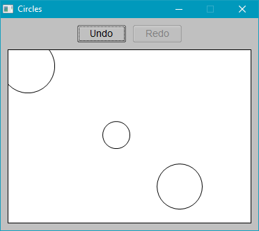

# 7guis-fltk-rs

This repository is an implementation of [the 7GUIs tasks](https://eugenkiss.github.io/7guis/) adapted to [Rust](https://www.rust-lang.org/) and [fltk-rs](https://github.com/MoAlyousef/fltk-rs).'


* Counter

```
$ cargo run --bin counter
```


* Temperature

```
$ cargo run --bin temperature
```


* Flightbooker

```
$ cargo run --bin flightbooker
```


* Timer

```
$ cargo run --bin timer
```


* CRUD

```
$ cargo run --bin crud
```


* Circles

```
$ cargo run --bin circles
```

